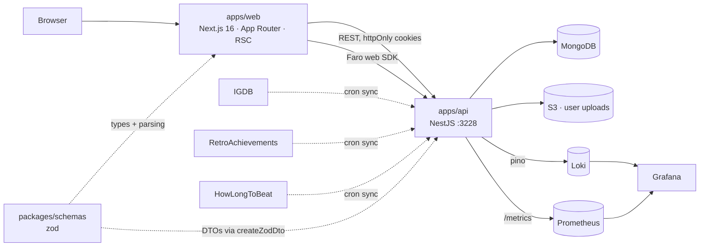

<h1 align="center">🌙 MoonCellar</h1>

<p align="center">
  A game tracking database — catalogue your backlog, log playthroughs, rate what you finished,<br>
  and let a wheel of fortune pick what you play next.
</p>

<p align="center">
  <a href="https://mooncellar.space"><b>Live site</b></a> ·
  <a href="https://api.mooncellar.space/api"><b>API docs</b></a>
</p>

<p align="center">
  
  
  
  
  
  
  
</p>

---

## Workspaces

One repository, one lockfile, three workspaces. Everything is installed and run from the root
with `bun --filter`.

| Workspace | Package name | What it is |
|---|---|---|
| `apps/web` | `web` | Next.js 16 App Router frontend — the site itself |
| `apps/api` | `api` | NestJS 11 service — catalogue, users, scheduled ingestion |
| `packages/schemas` | `@mooncellar/schemas` | Zod schemas shared by both: one definition, no copies |
| `infra/` | — | docker-compose stack: MongoDB, Loki, Grafana, Alloy, Prometheus, SearXNG |

```
MoonCellar/
├── apps/
│   ├── web/          # Next.js — see the frontend section below
│   └── api/          # NestJS — see the backend section below
├── packages/
│   └── schemas/      # @mooncellar/schemas — request/response contracts
├── infra/            # docker-compose.yml + grafana, monitoring, prometheus, searxng configs
├── docs/
└── package.json      # workspaces, catalog, shared tooling
```

---

## Architecture



---

## Running the monorepo locally

### Prerequisites

- [Bun](https://bun.sh) **1.3.12+** — the only supported package manager here. `npm install` is
  not used in this project and `package-lock.json` must never be committed.
- Docker or Podman with Compose, for MongoDB and the observability stack.

```bash
curl -fsSL https://bun.sh/install | bash   # if bun is not installed yet
bun --version                              # expect 1.3.12 or newer
```

### First run

```bash
# 1. Clone
git clone git@github.com:alexgrist14/MoonCellar.git
cd MoonCellar

# 2. Install every workspace at once — a single root node_modules and bun.lock
bun install

# 3. Environment: each app reads its own .env
cp apps/web/.env.example apps/web/.env
cp apps/api/.env.example apps/api/.env
#    then fill in the values — see the per-app tables below

# 4. Infrastructure: MongoDB, Loki, Grafana, Alloy, SearXNG
docker compose -f infra/docker-compose.yml up -d
#    Prometheus sits behind a profile and starts only when asked:
docker compose -f infra/docker-compose.yml --profile monitoring up -d

# 5. Build the shared schemas package once (both apps import its dist)
bun --filter '@mooncellar/schemas' build

# 6. Run everything in watch mode
bun run dev
```

`bun run dev` builds `@mooncellar/schemas` once, then starts all three watchers in parallel in
a single terminal — it is `dev:schemas`, `dev:api` and `dev:web` backgrounded together.

### Running the modules separately

One terminal per workspace. Use this when you want readable logs per process, a debugger
attached to just one of them, or only part of the stack running.

```bash
# once, before either app starts — both import the package's dist
bun --filter '@mooncellar/schemas' build

# terminal 1 — shared contracts, recompiled on every change
bun --filter '@mooncellar/schemas' dev     # tsc --watch → packages/schemas/dist

# terminal 2 — API on :3228, Swagger at :3228/api
bun --filter api start:dev                 # needs MongoDB from the compose stack

# terminal 3 — frontend on :3000
bun --filter web dev                       # needs the API up: pages fetch it while rendering
```

The root aliases run exactly these three: `bun run dev:schemas`, `bun run dev:api`,
`bun run dev:web`.

Three things that are easy to get wrong here:

- **Build `@mooncellar/schemas` before starting either app.** Both resolve the package to its
  `dist`, never its `src`, so on a fresh checkout the import fails until that first build exists.
  The watcher keeps it current from then on.
- **The API's script is `start:dev`, not `dev`.** `apps/api` has no `dev` script at all, which is
  why the root alias spells the name out.
- **Never start them with `bun --filter '*' dev`.** `bun --filter` runs the selected scripts in
  dependency order and waits for each dependency to exit first — `@mooncellar/schemas`'s `dev` is
  `tsc --watch`, which never exits, so `web dev` is never spawned at all and the terminal sits on
  the tsc watch banner with no Next.js output. The glob also skips `apps/api` in silence, because
  it has no script by that name. `build` and `lint` may keep `--filter '*'`: those scripts
  terminate, and there the dependency ordering is exactly what is wanted.

### Services and ports

| Service | URL | Comes from |
|---|---|---|
| Frontend (dev) | http://localhost:3000 | `bun --filter web dev` |
| Frontend (built) | http://localhost:3111 | `bun --filter web start` |
| API + Swagger | http://localhost:3228/api | `bun --filter api start:dev` |
| MongoDB | mongodb://localhost:27017 | compose |
| Grafana | http://localhost:3001 (`admin` / `admin`) | compose |
| Loki | http://localhost:3100 | compose |
| Alloy (Faro receiver) | http://localhost:12347 | compose |
| SearXNG | http://localhost:8891 | compose |
| Prometheus | http://localhost:9090 | compose, `monitoring` profile |

### Root commands

| Command | Effect |
|---|---|
| `bun install` | Installs all workspaces into one hoisted `node_modules` |
| `bun install --filter './apps/api...'` | Installs one app and its workspace dependencies only |
| `bun run dev` | Builds the schemas, then runs all three watchers in one terminal |
| `bun run dev:schemas` | `tsc --watch` for `@mooncellar/schemas` only |
| `bun run dev:api` | `api start:dev` only — watch mode on :3228 |
| `bun run dev:web` | `web dev` only — Next.js on :3000 |
| `bun run build` | `build` in every workspace |
| `bun run lint` | `lint` in every workspace |
| `bun run format:check` | Prettier over the whole repo |
| `bun --filter web <script>` | Runs a script in one workspace |
| `bun add <pkg> --filter web` | Adds a dependency to one workspace, never to the root |
| `bun add -d <pkg>` | Adds shared tooling to the root workspace |

Dependency versions shared by both apps (zod, typescript, eslint, prettier, `@types/node`) are
pinned once in the root `catalog` — bump them there, not in the app manifests. Two copies of
zod in the tree break type inference across the schemas package, so `zod` must resolve to a
single version.

---

<details>
<summary><b>🖥️ Frontend — <code>apps/web</code></b></summary>

<br>

Next.js 16 App Router application. All domain data comes from `apps/api`; the frontend owns
rendering, routing, and a handful of route handlers (geo lookup, image proxy, log forwarding).

### What it does

**Tracking.** Mark games as playing, completed, dropped or wishlisted; log individual
playthroughs; rate titles and keep a personal activity log.

**Catalogue.** Search and filter across a games database synced from IGDB — by platform,
genre, release year and more. Long result sets are windowed with `react-virtualized`, so
scrolling stays smooth on lists that would otherwise choke the DOM.

**Gauntlet.** A wheel of fortune that picks a game for you out of the filtered set — the
feature the project was originally built for. Filters are applied before the spin, so the
result is always something you'd actually play.

**Saved presets.** Filter combinations can be stored per user and reused.

**Social.** Follow other users and see their profiles, statuses and ratings.

**RetroAchievements.** Link a RetroAchievements account to pull achievements and progress
into the profile.

**Completion times.** Estimated playtimes sourced from HowLongToBeat.

**Admin panel.** A separate area for moderating games in the database.

### Code structure

Feature-Sliced Design — layers are ordered by how much they're allowed to know about each
other, and imports only ever point downwards.

```
apps/web/src/
├── app/                    # Next.js App Router — routes only, no logic
│   ├── games/[slug]/       #   catalogue and game pages
│   ├── gauntlet/           #   wheel of fortune
│   ├── user/[name]/        #   profiles
│   ├── admin/              #   moderation area
│   └── api/                #   route handlers: geo, image-proxy, logs
└── lib/
    ├── app/                # global styles, CSS variable scale, providers
    ├── pages/              # page-level composition
    ├── widgets/            # self-contained blocks (wheel container, main sections)
    ├── features/           # user-facing behaviour (wheel options, game actions)
    ├── entities/           # domain models (game)
    └── shared/             # ui kit, api clients, zustand stores, hooks
```

**State.** Zustand, split by concern rather than one global store: `auth`, `user`, `games`,
`filters`, `playthroughs`, `wheel`, `states`, `settings`, `geo`, `expand`, `common`.

**Design system.** All colors, radii, spacing and borders come from CSS variables declared in
`src/lib/app/styles/vars/` — no hardcoded values in components. Structural wrappers step down
one radius level per nesting depth (`--radius-x5` → `x4` → `x3`). Shared primitives (`Box`,
`Scrollbar`, `RowsModal`, `DatePicker`, `Svg`) are the only sanctioned way to build layout,
scrolling areas, modals, date fields and icons. The full set of rules lives in
[`apps/web/CLAUDE.md`](apps/web/CLAUDE.md).

**Server rendering.** The site's value in search is its ~10 000 game pages, so every change
must keep page content in the server-rendered HTML — see [`docs/seo.md`](docs/seo.md).

<details>
<summary>Tech stack</summary>

| Area | Tools |
|---|---|
| Framework | Next.js 16 (App Router, Turbopack), React 19 |
| Language | TypeScript 5.9 |
| State | Zustand 5 |
| Forms & validation | React Hook Form, zod 4 (`@mooncellar/schemas`) |
| Styling | Sass, CSS custom properties, CSS Modules |
| Data fetching | TanStack Query, axios with interceptors (token refresh, error reporting) |
| Performance | `react-virtualized`, `use-debounce`, `react-resize-detector`, `react-scan` |
| Observability | `@grafana/faro-web-sdk` → Grafana Alloy → Loki |
| Geo | `maxmind` (GeoIP country lookup) |

</details>

<details>
<summary>Environment — <code>apps/web/.env</code></summary>

| Variable | Purpose |
|---|---|
| `NEXT_PUBLIC_API_URL` | Public URL of the API (`http://localhost:3228` in dev) |
| `INTERNAL_API_URL` | API URL used from server components and route handlers |
| `NEXT_PUBLIC_FRONT_URL` | Public URL of this app — canonical links, SEO |
| `NEXT_PUBLIC_S3_HOST` | S3 / CDN host for user uploads |
| `NEXT_PUBLIC_LOKI_HOST` | Loki endpoint for the `/api/logs` handler |
| `NEXT_PUBLIC_CORS_SERVER` | Origin sent as CORS credentials target |
| `NEXT_PUBLIC_APP_VERSION` | Version tag attached to Faro telemetry |
| `NEXT_PUBLIC_FARO_APP_NAME` | App name in Grafana Faro |
| `GEOIP_DB_PATH` | Path to the GeoLite2 country database |
| `GEO_BLOCK_COUNTRIES` | Comma-separated country codes to block |

</details>

<details>
<summary>Scripts</summary>

```bash
bun --filter web dev            # dev server on :3000
bun --filter web build          # production build
bun --filter web start          # serve the build on :3111
bun --filter web lint           # eslint (max 10 warnings)
bun --filter web lint:fix       # eslint --fix
bun --filter web check:layout   # drives Chrome via playwright-core, fails on page overflow
bun --filter web sync:tokens    # regenerates the design tokens inside docs/mockups
bun --filter web check:tokens   # same read, exits 1 when a mockup is out of date
```

`check:layout` needs a running `bun --filter web start`; set `CHROME_PATH` if Chrome is not on
the default channel.

</details>

<details>
<summary>Error reporting</summary>

Errors don't just land in the browser console:

- route-level and global `error.tsx` / `global-error.tsx` boundaries forward failures to Loki
- the axios interceptor reports failed requests with URL, method and status code, including
  failures of the token refresh itself
- `window.onerror`, `unhandledrejection` and failed asset loads are captured globally

See [`apps/web/LOGGING.md`](apps/web/LOGGING.md) for the wiring.

</details>

</details>

---

<details>
<summary><b>⚙️ Backend — <code>apps/api</code></b></summary>

<br>

NestJS 11 service that owns the games catalogue, user progress, and the scheduled jobs that
keep the data fresh. Swagger UI is served at `/api`, generated from the same zod schemas the
frontend parses with, and annotated with cookie auth (`accessMoonToken`).

### Modules

| Module | Responsibility |
|---|---|
| `auth` | Sign-up, login, refresh, logout. JWT access + refresh tokens as httpOnly cookies; passport local and JWT strategies |
| `roles` | Role-based access control |
| `user` | Profile, ratings, activity logs, saved filter presets, followings, avatar uploads to S3 |
| `games` | Games catalogue, platforms, playthroughs, HowLongToBeat completion times |
| `igdb` | IGDB catalogue ingestion — the source of truth for game metadata |
| `retroach` | RetroAchievements integration: consoles, achievements, per-user progress |
| `steam` | Steam integration |
| `admin` | Moderation endpoints for the catalogue |
| `metrics` | Prometheus HTTP, business and MongoDB metrics |
| `logger` | Structured logging via pino, shipped to Loki |
| `faro` | Collector endpoint for frontend telemetry (Grafana Faro) |
| `indexnow` | IndexNow pings so new game pages get indexed by search engines |

### Data model

MongoDB via Mongoose — `game`, `platform`, `playthroughs`, `sync-state`, `user`, `user-logs`,
`user-ratings`, `role`, plus `retroach` and `console` for the RetroAchievements side.

`sync-state` is what makes the ingestion jobs restartable: each source stores its own
checkpoint, so a sync resumes from the last processed `updated_at` instead of re-walking the
whole upstream catalogue.

<details>
<summary>Scheduled ingestion</summary>

Three cron jobs keep the catalogue current. Each one is **checkpointed** (progress persisted
per source), **single-flight** (a guard skips the tick if the previous run is still going),
**rate-limit aware** (bounded concurrency and inter-batch delays, tuned per upstream) and
**instrumented** (duration and record counts reported under a per-job correlation context).

| Job | Source | What it pulls |
|---|---|---|
| `igdb-games-sync` | IGDB (Twitch OAuth) | Game metadata, releases, platforms, genres |
| RetroAchievements sync | RetroAchievements API | Consoles, achievements, user progress |
| HowLongToBeat sync | HowLongToBeat | Completion time estimates |

</details>

<details>
<summary>Observability</summary>

**Logs.** `nestjs-pino` for structured JSON logs, shipped to Loki via `pino-loki`. Cron runs
execute inside a log context so every line from a single sync can be traced together.

**Metrics.** A Prometheus endpoint exposing HTTP request duration and counters (labelled by
`method`, `route`, `status_code`), sync duration per job, games added/updated by source, user
registrations, achievements processed, and MongoDB command metrics. The endpoint is
token-guarded (`METRICS_TOKEN`) and can be switched off with `PROMETHEUS_ENABLED`.

**Frontend telemetry.** The `faro` module receives browser-side errors and web vitals from
`apps/web` and forwards them into the same Grafana stack.

**Dashboards.** Grafana provisioning lives in `infra/grafana/provisioning`, Prometheus scrape
config in `infra/prometheus/`, and the Alloy receiver config in `infra/monitoring/faro.alloy`.

</details>

<details>
<summary>Environment — <code>apps/api/.env</code></summary>

| Variable | Purpose |
|---|---|
| `MONGO_CONNECTION_STRING` | MongoDB connection string (database `games`) |
| `JWT_SECRET` / `JWT_EXPIRE` | Signing key and lifetime for access and refresh tokens |
| `FRONT_URL` | Public frontend URL — CORS, links in generated content |
| `LOCAL_CONNECTION` | Extra comma-separated origins allowed by CORS in dev |
| `TWITCH_CLIENT_ID` / `TWITCH_CLIENT_SECRET` | IGDB API credentials (IGDB authenticates via Twitch) |
| `RETROACHIEVEMENTS_API_KEY` | RetroAchievements API key |
| `S3_ID`, `S3_KEY`, `S3_ENDPOINT`, `S3_BUCKET`, `S3_CDN_URL` | DigitalOcean Spaces: one bucket, one folder per content type |
| `LOKI_HOST` | Loki endpoint for log shipping |
| `FARO_COLLECTOR_URL` | Grafana Alloy / Faro collector endpoint |
| `PROMETHEUS_ENABLED` | Toggle the metrics endpoint |
| `METRICS_TOKEN` | Bearer token guarding `/metrics` |
| `INDEXNOW_KEY` | IndexNow key for search engine submission |
| `SEARXNG_URL`, `API_BASE_URL`, `ADMIN_EMAIL`, `ADMIN_PASSWORD` | Used by the `game-adder` MCP server |

</details>

<details>
<summary>Scripts</summary>

```bash
bun --filter api start:dev      # watch mode on :3228
bun --filter api start:prod     # run the build
bun --filter api build          # nest build
bun --filter api lint           # eslint
bun --filter api test           # unit tests (jest + automock)
bun --filter api test:e2e       # e2e tests (supertest)
bun --filter api test:cov       # coverage
```

</details>

</details>

---

<details>
<summary><b>📐 Shared contracts — <code>packages/schemas</code></b></summary>

<br>

Every request and response shape is a zod schema, defined once and consumed by both apps:

- **`apps/api`** — `createZodDto` (nestjs-zod) turns each schema into a NestJS DTO, a global
  `ZodValidationPipe` enforces it, and the same schemas feed the OpenAPI document, so Swagger
  never drifts from the actual validation rules.
- **`apps/web`** — the same schemas type the API client and parse responses.

```
packages/schemas/src/
├── characters.schema.ts        ├── ra.schema.ts
├── files.schema.ts             ├── role.schema.ts
├── game-followings-status.ts   ├── user.schema.ts
├── game-stats.schema.ts        ├── user-logs.schema.ts
├── games.schema.ts             ├── user-ratings.schema.ts
├── platforms.schema.ts         ├── utils.ts
├── playthroughs.schema.ts      └── index.ts
```

The package compiles to CommonJS with declarations, which both Nest (webpack/tsc) and Next
consume without special handling:

```bash
bun --filter '@mooncellar/schemas' build     # tsc → dist
bun --filter '@mooncellar/schemas' dev       # tsc --watch
```

`zod` is a peer dependency resolved from the root catalog — a second copy in the tree silently
breaks type inference and `instanceof` checks across package boundaries.

IGDB response shapes (`igdb.schema.ts`) stay in `apps/web`: they describe an upstream API the
frontend reads directly and are not part of the contract between the two apps.

</details>

---

<details>
<summary><b>🐳 Infrastructure and deployment — <code>infra/</code></b></summary>

<br>

`infra/docker-compose.yml` brings up MongoDB, Loki, Grafana, Alloy and SearXNG; Prometheus is
behind the `monitoring` profile. Config files live next to it — `grafana/provisioning`,
`prometheus/prometheus.yml`, `monitoring/faro.alloy`, `searxng/`.

```bash
docker compose -f infra/docker-compose.yml up -d
docker compose -f infra/docker-compose.yml --profile monitoring up -d
docker compose -f infra/docker-compose.yml down
docker compose -f infra/docker-compose.yml logs -f mongodb
```

### Container images

Each app has its own Dockerfile, but both build from the **repository root** as context, so the
root lockfile and the shared package are available:

```bash
podman build -f apps/web/Dockerfile -t mooncellar-frontend:latest .
podman build -f apps/api/Dockerfile -t mooncellar-backend:latest .
```

### CI/CD

One workflow, `.github/workflows/ci.yml`, with three jobs:

| Job | What it does |
|---|---|
| `changes` | Decides which workspaces a push touched — `apps/web/**`, `apps/api/**`, `packages/**` or the root manifests |
| `lint` | Installs once and lints every workspace, on every push and pull request |
| `deploy` | On `main` only, and only for the apps `changes` marked |

The deploy job builds just the changed images, packs them into a single multi-image archive
(both share the `oven/bun` base layer, so one archive is smaller than two), copies it over in
one transfer and restarts only the services it rebuilt — one SSH session for both apps. Each
app's environment file comes from its own secret: `HOST_ENV_WEB` and `HOST_ENV_API`.

Every secret the pipeline needs, the contents of both `HOST_ENV_*` files and a checklist for
the first deploy are documented in [`docs/deploy-env.md`](docs/deploy-env.md).

Commits follow Conventional Commits, enforced locally by commitlint and husky from the
repository root.

</details>

---

## License

Source-available, not open source. The code may be read, forked and improved by pull request;
deploying it, hosting it or reusing it elsewhere is not permitted. Using the official site at
[mooncellar.space](https://mooncellar.space) is not restricted by the licence at all.

See [`LICENSE`](LICENSE), the [contribution terms](CONTRIBUTING.md), and
[what the licence means in practice](docs/license.md).
