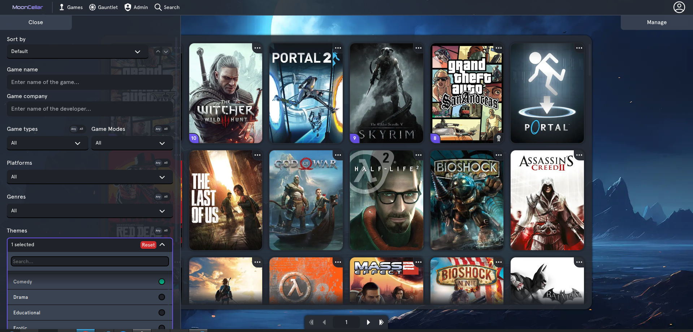
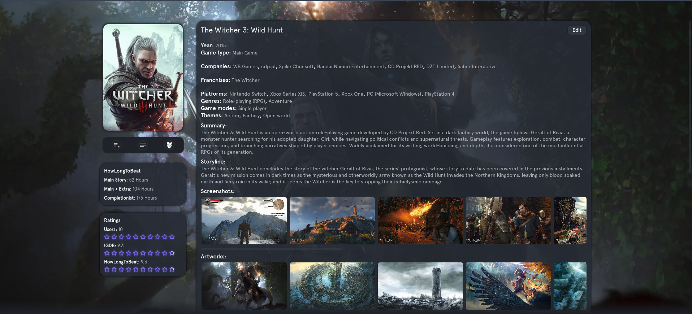
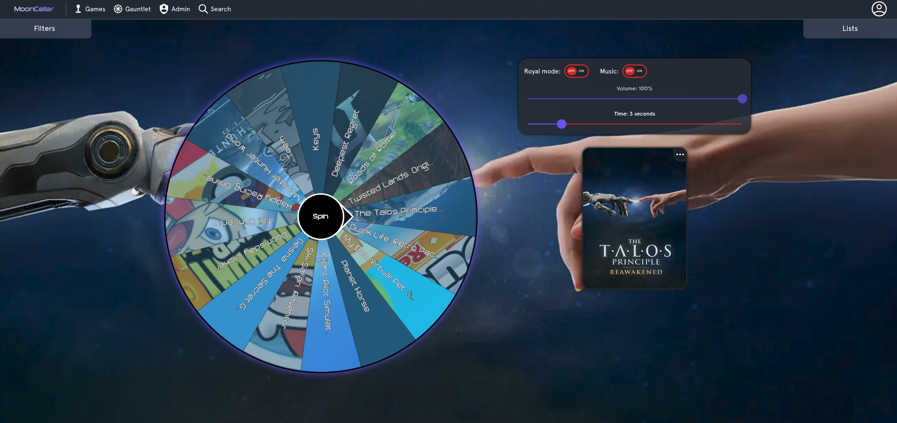
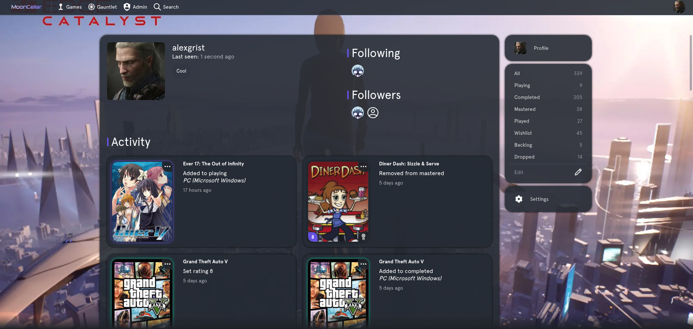
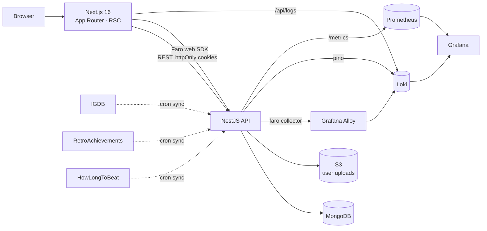

<h1 align="center">🌙 MoonCellar</h1>

<p align="center">
  A game tracking database — catalogue your backlog, log playthroughs, rate what you finished,<br>
  and let a wheel of fortune pick what you play next.
</p>

<p align="center">
  <a href="https://mooncellar.space"><b>Live site</b></a> ·
  <a href="https://api.mooncellar.space/api"><b>API docs</b></a> ·
  <a href="https://github.com/alexgrist14/MoonCellar-Server"><b>Backend repo</b></a>
</p>

<p align="center">
  
  
  
  
  
  
  
</p>

---

## Screenshots

| Catalogue | Game page |
|---|---|
|  |  |

| Gauntlet (wheel of fortune) | User profile |
|---|---|
|  |  |

---

## What it does

**Tracking.** Mark games as playing, completed, dropped or wishlisted; log individual
playthroughs; rate titles and keep a personal activity log.

**Catalogue.** Search and filter across a games database synced from IGDB — by platform,
genre, release year and more. Long result sets are windowed with `react-virtualized`, so
scrolling stays smooth on lists that would otherwise choke the DOM.

**Gauntlet.** A wheel of fortune that picks a game for you out of the filtered set — the
feature the project was originally built for. Filters (platform, genre, rating range) are
applied before the spin, so the result is always something you'd actually play.

**Saved presets.** Filter combinations can be stored per user and reused, instead of being
rebuilt every visit.

**Social.** Follow other users and see their profiles, statuses and ratings.

**RetroAchievements.** Link a RetroAchievements account to pull achievements and progress
into the profile.

**Completion times.** Estimated playtimes sourced from HowLongToBeat.

**Admin panel.** A separate area for moderating games in the database.

---

## Architecture

The frontend is a Next.js App Router application; all domain data comes from a separate
NestJS service ([MoonCellar-Server](https://github.com/alexgrist14/MoonCellar-Server)).



### Code structure

Feature-Sliced Design — layers are ordered by how much they're allowed to know about each
other, and imports only ever point downwards.

```
src/
├── app/                    # Next.js App Router — routes only, no logic
│   ├── games/[slug]/       #   catalogue and game pages
│   ├── gauntlet/           #   wheel of fortune
│   ├── user/[name]/        #   profiles
│   ├── admin/              #   moderation area
│   └── api/                #   route handlers: geo, image-proxy, logs
└── lib/
    ├── app/                # global styles, CSS variable scale, providers
    ├── pages/              # page-level composition
    ├── widgets/            # self-contained blocks (wheel container, main sections)
    ├── features/           # user-facing behaviour (wheel options, game actions)
    ├── entities/           # domain models (game)
    └── shared/             # ui kit, api clients, zustand stores, hooks, schemas
```

**State.** Zustand, split by concern rather than one global store: `auth`, `user`, `games`,
`filters`, `playthroughs`, `wheel`, `states`, `settings`, `geo`, `expand`, `common`.

**Design system.** All colors, radii, spacing and borders come from CSS variables declared in
`src/lib/app/styles/vars/` — no hardcoded values in components. Structural wrappers step down
one radius level per nesting depth (`--radius-x5` → `x4` → `x3`), which keeps nested cards,
inputs and dropdowns visually consistent without per-component tweaking. Shared primitives
(`Box`, `Scrollbar`, `RowsModal`, `Svg`) are the only sanctioned way to build layout, scrolling
areas, modals and icons.

---

## Shared validation with the backend

Request and response shapes are defined once as zod schemas and kept **byte-identical** between
this repo (`src/lib/shared/lib/schemas/`) and the server (`src/shared/zod/schemas/`). The server
copy is canonical: `createZodDto` generates the NestJS DTOs from it, so the API contract and the
client's parsing rules cannot drift apart.

A script enforces it:

```bash
bun run check:schemas
```

It diffs both copies and fails if they diverge — the check runs against the sibling server
checkout, so a schema change that only lands on one side never reaches `main`.

---

## Tech stack

| Area | Tools |
|---|---|
| Framework | Next.js 16 (App Router, Turbopack), React 19 |
| Language | TypeScript 5.9 |
| State | Zustand 5 |
| Forms & validation | React Hook Form, zod 4 |
| Styling | Sass, CSS custom properties, CSS Modules |
| Data fetching | axios with interceptors (token refresh, error reporting) |
| Performance | `react-virtualized`, `use-debounce`, `react-resize-detector`, `react-scan` |
| Observability | `@grafana/faro-web-sdk` → Grafana Alloy → Loki |
| Geo | `maxmind` (GeoIP country lookup) |
| Tooling | Bun, ESLint 9, Prettier, Husky, lint-staged, commitlint |

---

## Getting started

### Prerequisites

- [Bun](https://bun.sh) 1.3.12+ — the only supported package manager here; `npm install` is
  not used in this project
- A running [MoonCellar-Server](https://github.com/alexgrist14/MoonCellar-Server) instance
  (its `docker-compose.yml` brings up MongoDB, Loki, Grafana and Alloy)

### Setup

```bash
git clone https://github.com/alexgrist14/MoonCellar.git
cd MoonCellar
bun install
cp .env.example .env.local   # then fill in the values below
bun run dev                  # http://localhost:3000
```

### Environment

| Variable | Purpose |
|---|---|
| `NEXT_PUBLIC_API_URL` | Public URL of the API (`http://localhost:3228` in dev) |
| `INTERNAL_API_URL` | API URL used from server components / route handlers |
| `NEXT_PUBLIC_FRONT_URL` | Public URL of this app — canonical links, SEO |
| `NEXT_PUBLIC_CORS_SERVER` | Origin sent as CORS credentials target |
| `NEXT_PUBLIC_APP_VERSION` | Version tag attached to Faro telemetry |
| `NEXT_PUBLIC_FARO_APP_NAME` | App name in Grafana Faro |
| `LOKI_HOST` | Loki endpoint for the `/api/logs` handler |
| `GEO_BLOCK_COUNTRIES` | Comma-separated country codes to block |

### Scripts

```bash
bun run dev            # dev server
bun run build          # production build
bun run start          # serve the build on :3111
bun run lint           # eslint (max 10 warnings)
bun run lint:fix       # eslint --fix
bun run format         # prettier
bun run check:schemas  # zod schema parity with the server repo
```

---

## Error reporting

Errors don't just land in the browser console:

- route-level and global `error.tsx` / `global-error.tsx` boundaries forward failures to Loki
- the axios interceptor reports failed requests with URL, method and status code, including
  failures of the token refresh itself
- `window.onerror`, `unhandledrejection` and failed asset loads are captured globally

See [LOGGING.md](./LOGGING.md) for the wiring.

---

## CI/CD

GitHub Actions runs lint and a Prettier check on every push and pull request. On `main`, the
workflow builds a container image with podman and deploys it over SSH to the production host,
where it runs behind Nginx.

---

## License

[GPL-3.0](./LICENSE)
