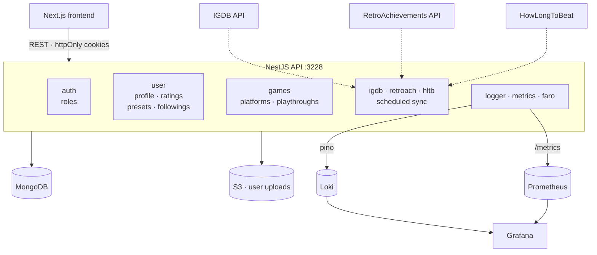

<h1 align="center">🌙 MoonCellar API</h1>

<p align="center">
  The backend for <a href="https://mooncellar.space">mooncellar.space</a> — a game tracking
  database.<br>
  NestJS service that owns the games catalogue, user progress, and the scheduled jobs that keep
  the data fresh.
</p>

<p align="center">
  <a href="https://api.mooncellar.space/api"><b>Swagger docs</b></a> ·
  <a href="https://mooncellar.space"><b>Live site</b></a> ·
  <a href="https://github.com/alexgrist14/MoonCellar"><b>Frontend repo</b></a>
</p>

<p align="center">
  
  
  
  
  
  
  
</p>

---

## Overview



---

## Modules

| Module | Responsibility |
|---|---|
| `auth` | Sign-up, login, refresh, logout. JWT access + refresh tokens issued as httpOnly cookies; passport local and JWT strategies |
| `roles` | Role-based access control |
| `user` | Profile, ratings, activity logs, saved filter presets, followings, avatar uploads to S3 |
| `games` | Games catalogue, platforms, playthroughs, HowLongToBeat completion times |
| `igdb` | IGDB catalogue ingestion — the source of truth for game metadata |
| `retroach` | RetroAchievements integration: consoles, achievements, per-user progress |
| `admin` | Moderation endpoints for the catalogue |
| `metrics` | Prometheus HTTP, business and MongoDB metrics |
| `logger` | Structured logging via pino, shipped to Loki |
| `faro` | Collector endpoint for frontend telemetry (Grafana Faro) |
| `indexnow` | IndexNow pings so new game pages get indexed by search engines |

---

## Data model

MongoDB via Mongoose — `game`, `platform`, `playthroughs`, `sync-state`, `user`, `user-logs`,
`user-ratings`, `role`, plus `retroach` and `console` for the RetroAchievements side.

`sync-state` is what makes the ingestion jobs restartable: each source stores its own
checkpoint, so a sync resumes from the last processed `updated_at` instead of re-walking the
whole upstream catalogue.

---

## Validation: one schema, two repos

Every request and response shape is a zod schema in `src/shared/zod/schemas/`. Two things hang
off that single definition:

1. **Server DTOs** — `createZodDto` (nestjs-zod) generates the NestJS DTOs, and a global
   `ZodValidationPipe` enforces them. The same schemas feed the OpenAPI document, so Swagger
   never drifts from the actual validation rules.
2. **The frontend's copy** — the schema files are kept byte-identical in
   [MoonCellar](https://github.com/alexgrist14/MoonCellar)'s `src/lib/shared/lib/schemas/`.
   This repo is canonical.

```bash
bun run check:schemas   # fails if the two copies diverge
```

---

## Scheduled ingestion

Three cron jobs keep the catalogue current. Each one is wrapped so that operational problems
stay visible and bounded:

- **checkpointed** — progress is persisted per source, so a restart resumes instead of starting over
- **single-flight** — a guard skips the tick if the previous run is still going, which matters
  when an upstream API slows down and a run outlasts its interval
- **rate-limit aware** — bounded concurrency and inter-batch delays, tuned per upstream
- **instrumented** — every run reports duration and the number of records added or updated, and
  logs under a per-job correlation context

| Job | Source | What it pulls |
|---|---|---|
| `igdb-games-sync` | IGDB (Twitch OAuth) | Game metadata, releases, platforms, genres |
| RetroAchievements sync | RetroAchievements API | Consoles, achievements, user progress |
| HowLongToBeat sync | HowLongToBeat | Completion time estimates |

---

## Observability

**Logs.** `nestjs-pino` for structured JSON logs, shipped to Loki via `pino-loki`. Cron runs
execute inside a log context so every line from a single sync can be traced together.

**Metrics.** Prometheus endpoint exposing:

- HTTP request duration histogram and request counter, labelled by `method`, `route` and
  `status_code`, collected by a global interceptor
- sync duration per job
- games added / updated, by source
- user registrations, achievements processed
- MongoDB command metrics (`monitorCommands` is on)

The endpoint is token-guarded (`METRICS_TOKEN`) and can be switched off with
`PROMETHEUS_ENABLED`.

**Frontend telemetry.** The `faro` module receives browser-side errors and web vitals from the
Next.js app and forwards them into the same Grafana stack, so a broken page and the API call
behind it end up in one place.

**Dashboards.** Grafana provisioning lives in `grafana/provisioning`, Prometheus scrape config
in `prometheus/`, and the Alloy receiver config in `monitoring/faro.alloy` — the whole stack
comes up from `docker-compose.yml`.

---

## Getting started

### Prerequisites

- [Bun](https://bun.sh) 1.3.12+ — the only supported package manager here
- Docker / Podman for the local infrastructure

### Setup

```bash
git clone https://github.com/alexgrist14/MoonCellar-Server.git
cd MoonCellar-Server
bun install

cp .env.example .env          # then fill in the values below
docker compose up -d          # mongodb, loki, grafana, alloy
bun run start:dev             # http://localhost:3228 — docs at /api
```

Prometheus is behind a compose profile, so it only starts when you ask for it:

```bash
docker compose --profile monitoring up -d
```

| Service | URL |
|---|---|
| API + Swagger | http://localhost:3228/api |
| Grafana | http://localhost:3001 (`admin` / `admin`) |
| Loki | http://localhost:3100 |
| Prometheus | http://localhost:9090 |
| MongoDB | mongodb://localhost:27017 |

### Environment

| Variable | Purpose |
|---|---|
| `MONGO_CONNECTION_STRING` | MongoDB connection string (database `games`) |
| `JWT_SECRET` | Signing key for access and refresh tokens |
| `FRONT_URL` | Public frontend URL — CORS, links in generated content |
| `LOCAL_CONNECTION` | Extra comma-separated origins allowed by CORS in dev |
| `TWITCH_CLIENT_ID` / `TWITCH_CLIENT_SECRET` | IGDB API credentials (IGDB authenticates via Twitch) |
| `RETROACHIEVEMENTS_API_KEY` | RetroAchievements API key |
| `S3_HOST`, `S3_HOST_CDN`, `S3_ID`, `S3_KEY`, `S3_REGION` | S3 storage for user uploads |
| `LOKI_HOST` | Loki endpoint for log shipping |
| `FARO_COLLECTOR_URL` | Grafana Alloy / Faro collector endpoint |
| `PROMETHEUS_ENABLED` | Toggle the metrics endpoint |
| `METRICS_TOKEN` | Bearer token guarding `/metrics` |
| `INDEXNOW_KEY` | IndexNow key for search engine submission |

### Scripts

```bash
bun run start:dev      # watch mode
bun run start:prod     # run the build
bun run build          # nest build
bun run lint           # eslint
bun run format         # prettier
bun run test           # unit tests (jest + automock)
bun run test:e2e       # e2e tests (supertest)
bun run test:cov       # coverage
bun run check:schemas  # zod schema parity with the frontend repo
```

---

## API documentation

Swagger UI is served at `/api`, generated from the zod schemas and annotated with cookie auth
(`accessMoonToken`), so authenticated endpoints can be exercised straight from the browser.

---

## CI/CD

GitHub Actions runs lint and a Prettier check on every push and pull request. On `main`, the
workflow builds a container image with podman and deploys it over SSH to the production host.
Commits follow Conventional Commits, enforced locally by commitlint and husky.

---

## License

[GPL-3.0](./LICENSE)
