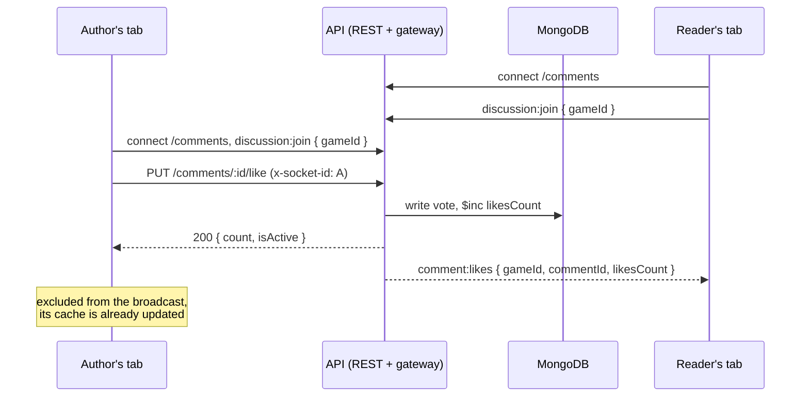
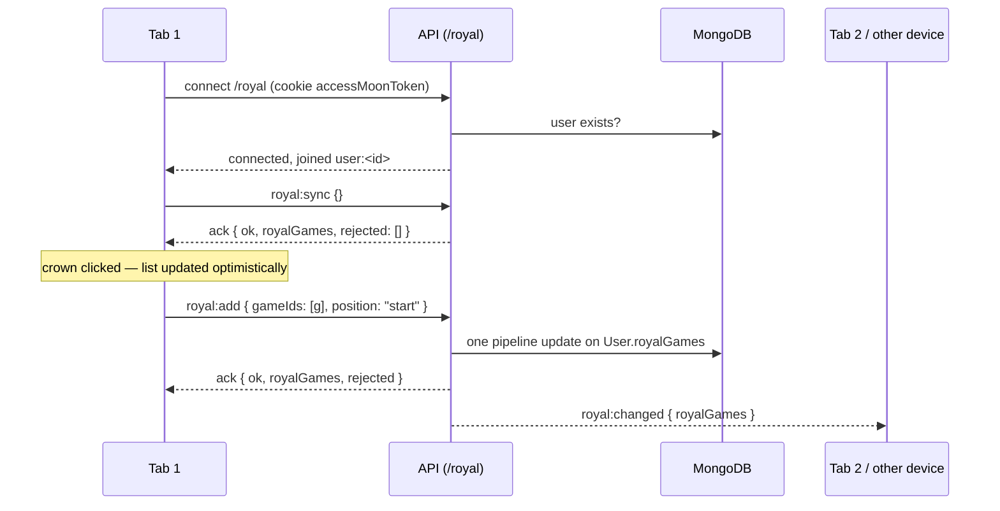

# Sockets

MoonCellar keeps three real-time channels open over Socket.IO, all served by the API process:

| Namespace | Who connects | What it does |
|---|---|---|
| `/comments` | Anyone with a game's Discussion tab open | **Notifications only.** Tells other readers that a comment was posted, edited, moderated or liked. Every change still goes through REST. |
| `/royal` | Every signed-in user, on every page | **State.** Royal games — the user's list of games for the royal wheel — are read and changed over this socket and pushed to the user's other tabs and devices. |
| `/vndb-review` | Admins with the VNDB candidates tab open | **Notifications only.** Tells other admins that a VN was matched or skipped, and when queued decisions were written to games. |

This document describes how they work, every event on the wire, what depends on the sockets and
what deliberately does not.

Verified on 2026-09-15 with Bun 1.4.2, NestJS 11.2, Socket.IO 4.8.3, MongoDB 8.2 and Next.js
16.3.0-preview.6.

## Shared server setup

| | |
|---|---|
| Library | Socket.IO 4.8 through `@nestjs/websockets` + `@nestjs/platform-socket.io` 11 |
| Server | The API process itself, same port (3228), HTTP path `/socket.io/` |
| Adapter | `SocketIoAdapter` (`apps/api/src/shared/socket-io.adapter.ts`), installed in `main.ts` |
| Contract | `packages/schemas/src/comments-socket.schema.ts`, `packages/schemas/src/royal-games.schema.ts`, `packages/schemas/src/vndb-review-socket.schema.ts` |

- **Transports.** Default Socket.IO behaviour: an HTTP long-polling handshake, then an upgrade to
  WebSocket. If the upgrade is blocked (see [Deployment](#deployment)) the connection keeps
  working over polling.
- **CORS is server-wide.** Nest creates one Socket.IO server per port from the options of the
  first gateway it initialises and ignores the options of the others, so no gateway declares
  `cors`. `SocketIoAdapter` sets it once for every namespace: the origins of the REST API
  (`getCorsOrigins()` in `apps/api/src/shared/cors.ts` — `LOCAL_CONNECTION` plus
  `https://mooncellar.space`) and `credentials: true`, which `/royal` needs to receive the session
  cookie over polling. Only polling requests are subject to CORS; a foreign origin gets no
  `Access-Control-Allow-Origin` header.
- **Global enhancers do not apply to gateway handlers.** Nest creates the WebSocket context
  creators without the application config, so neither `ZodValidationPipe` (`APP_PIPE`) nor
  `HttpMetricsInterceptor` (`APP_INTERCEPTOR`) runs for socket messages. Every handler validates
  its payload with the zod schema from the contract and reports problems through the ack instead
  of throwing.
- **Pinned to Nest 11.** `@nestjs/websockets` and `@nestjs/platform-socket.io` follow the major of
  `@nestjs/core`; their npm `latest` is already 12.x.
- **Acknowledgements.** A handler's return value is sent back as the Socket.IO ack when the client
  asked for one.

---

## `/comments` — live discussion

The Discussion tab of a game page updates live: when someone posts, edits, deletes, hides or likes
a comment, every other open Discussion tab of that game reflects it without a reload.

| | |
|---|---|
| Rooms | `discussion:<gameId>`, one per game |
| Authentication | None — the socket is anonymous |
| Server code | `apps/api/src/module/comments/gateways/comments.gateway.ts` |
| Client code | `apps/web/src/lib/shared/socket/comments.socket.ts`, `socket-id.ts`, `apps/web/src/lib/entities/comment/api/comment.socket.ts` |
| Only consumer | `DiscussionTab` (`apps/web/src/lib/features/game/GameCommunity/components/DiscussionTab.tsx`) |

### Flow



1. The user opens the Discussion tab. `DiscussionTab` mounts and calls
   `useDiscussionSocket(gameId)`, which subscribes to the events and calls
   `followDiscussion(gameId)`. That opens the shared socket if it is not open yet and emits
   `discussion:join`.
2. Someone changes a comment through REST. The controller reads the `x-socket-id` header, the
   service writes to MongoDB and then calls a `CommentsGateway` method, which emits to the game's
   room **except** the socket named in the header.
3. Every other tab in the room receives the event and updates its React Query cache — either by
   patching the cached comment or by invalidating the affected lists so they refetch.
4. When the tab unmounts (the user leaves the game page), the hook unfollows. The socket leaves
   the room, and when no game is followed any more it disconnects.
5. After a dropped connection Socket.IO reconnects on its own. The server has forgotten the
   socket's rooms by then, so the client re-joins every followed game on `connect`, and on
   `reconnect` invalidates the discussion caches to pick up whatever happened while it was offline.

### Connection

- **URL.** The client connects to `${NEXT_PUBLIC_API_URL}/comments`. Socket.IO takes the origin
  from that URL, the namespace from its path, and always talks to `/socket.io/`. The API URL must
  therefore be a bare origin — with a path such as `/v1` the client asks for namespace
  `/v1/comments` and fails with `Invalid namespace`.
- **Lifecycle.** One socket per browser tab, created lazily (`autoConnect: false`) and shared by
  every followed game. It opens when the first Discussion tab mounts and closes when the last one
  unmounts. A game page whose Discussion tab is never opened opens no connection.
- **Authentication.** None. Everything a socket receives is what `GET /games/:gameId/comments`
  already returns to an anonymous visitor, so there is nothing to protect on the connection.

### Client → server events

Both events take `{ gameId }` and answer through an ack when the client asks for one. The web
client emits them without an ack; the ack exists for scripts and tests.

| Event | Payload | Ack |
|---|---|---|
| `discussion:join` | `{ gameId: string }` — 24 hex characters | `{ ok: true }` |
| | | `{ ok: false, error: "Invalid game id" }` |
| | | `{ ok: false, error: "Too many discussions followed" }` |
| `discussion:leave` | `{ gameId: string }` | `{ ok: true }` or `{ ok: false, error: "Invalid game id" }` |

- One socket may follow at most `DISCUSSION_ROOMS_LIMIT` (10) games. Joining a game it already
  follows always succeeds.
- The server does not check that the game exists. A room for a non-existent game simply never
  receives anything.

### Server → client events

Every event is sent to `discussion:<gameId>`, minus the socket named in `x-socket-id`. Counts are
the **absolute values after the change**, never deltas, so applying an event twice — or on top of
the author's own optimistic update — cannot double-count.

#### `comment:created`

Emitted by `CommentsService.createComment` — `POST /comments`.

| Field | Type | Meaning |
|---|---|---|
| `gameId` | string | Game, also the room |
| `commentId` | string | The new comment |
| `parentId` | string \| null | Top-level comment of the thread; `null` for a top-level comment |
| `parentRepliesCount` | number \| null | The parent's visible replies after the insert; `null` for a top-level comment |

Client: a top-level comment invalidates the discussion lists of the game (both sorts), because
where it lands depends on the sort and the page. A reply sets the parent's `repliesCount` and
invalidates that parent's replies list.

#### `comment:updated`

Emitted by `CommentsService.updateComment` — `PATCH /comments/:id`.

| Field | Type | Meaning |
|---|---|---|
| `gameId`, `commentId` | string | |
| `body` | string | Sanitized rich text |
| `isSpoiler` | boolean | |
| `updatedAt` | string | ISO date |

Client: patches `body`, `isSpoiler` and `updatedAt` of the cached comment in the discussion and
replies lists. Only visible comments can be edited, so the body is public.

#### `comment:status`

Emitted by `CommentsService.changeStatus` — `DELETE /comments/:id` (`deleted`) and
`PATCH /comments/:id/status` (`hidden` / `visible`, admins only).

| Field | Type | Meaning |
|---|---|---|
| `gameId`, `commentId` | string | |
| `parentId` | string \| null | Top-level comment of the thread |
| `parentRepliesCount` | number \| null | The parent's visible replies after the change; `null` when the count did not change or the comment is top-level |
| `status` | `"visible"` \| `"hidden"` \| `"deleted"` | New status |

Client: sets the parent's `repliesCount` when it is present, then invalidates the discussion and
replies lists. The event carries no body on purpose: what a reader sees after a status change
depends on who they are (an admin still reads a hidden comment), so each tab refetches through
REST.

#### `comment:likes`

Emitted by `CommentsService.setLike` — `PUT` and `DELETE /comments/:id/like` — only when the vote
actually changed.

| Field | Type | Meaning |
|---|---|---|
| `gameId`, `commentId` | string | |
| `likesCount` | number | Likes after the change |

Client: sets `likesCount` on the cached comment. The reader's own `isLiked` is left alone.

### Sender exclusion: `x-socket-id`

The tab that made a change has already updated its cache from the REST response. Receiving its own
event would only make it refetch the same data, so the change request names the socket to skip.

- `apps/web/src/lib/shared/api/comments.api.ts` adds `x-socket-id: <socket.id>` to `create`,
  `update`, `remove`, `setLike` and `updateStatus` while the socket is connected. The id comes from
  `shared/socket/socket-id.ts`, which the socket updates on `connect` and clears on `disconnect`.
- `CommentsController` passes the header to the service, and the gateway broadcasts with
  `.except(socketId)`.
- It is not a security boundary. A forged id can only stop one other socket from receiving
  notifications, and that socket still has REST.
- The header makes cross-origin change requests preflighted; they already were because of
  `x-user-id`, and `enableCors` reflects requested headers.

### What depends on `/comments`

| Feature | On the socket |
|---|---|
| New top-level comments appearing in an open Discussion tab | Yes — `comment:created` |
| Reply counters and open reply threads | Yes — `comment:created`, `comment:status` |
| Edited comment text and spoiler flag | Yes — `comment:updated` |
| Deleted, hidden and restored comments | Yes — `comment:status` |
| Like counters | Yes — `comment:likes` |
| Catching up after a lost connection | Yes — refetch on `reconnect` |

### What does not

| Feature | Why |
|---|---|
| Loading comments, pagination, sorting | REST (`GET /games/:gameId/comments`, `GET /comments/:id/replies`) |
| Posting, editing, deleting, liking, reporting, moderating | REST; the socket only announces the result |
| Reviews tab and helpful votes (`/reviews/:id/helpful`) | Not wired; the reviews list refreshes on its own `staleTime` |
| Reports (`POST /comments/:id/report`) and `reportsCount` | Admin-only data, never broadcast to an anonymous room |
| The reader's own `isLiked` / `isReported` | Viewer-specific; a like from another tab of the same user updates the count, not the heart |
| Hidden comment bodies for admins | Viewer-specific; fetched through REST after `comment:status` |
| Tab counter before the Discussion tab is opened | The socket is not connected until then |

The rule behind the split: a room is anonymous, so an event may contain only what an anonymous
reader already gets from REST. `CommentsService.decorate()` fills viewer-specific fields for one
viewer; broadcasting its output would hand that viewer's flags — or an admin's view — to everyone
in the room.

### Server implementation

- `CommentsGateway` is a provider of `CommentsModule` and is injected into `CommentsService`. The
  service emits after the MongoDB write has succeeded.
- The emit methods are no-ops while the gateway has no server — in unit tests and in `check:boot`,
  which resolves the DI graph without starting the application.
- The reply counter is incremented with `findByIdAndUpdate(..., { new: true })` so the event can
  carry the resulting value.

### Client implementation

| File | Role |
|---|---|
| `shared/socket/comments.socket.ts` | The singleton socket; `followDiscussion(gameId)` counts followers per game, joins on first follow, leaves on last unfollow, disconnects when nothing is followed, re-joins everything on `connect` |
| `shared/socket/socket-id.ts` | The current socket id, with no dependencies, so `shared/api` can read it without pulling `socket.io-client` into every bundle |
| `entities/comment/api/comment.socket.ts` | `useDiscussionSocket(gameId)`: event → React Query cache |
| `entities/comment/api/comment.cache.ts` | `setCommentInCache` and `invalidateDiscussion`, shared by the mutations and the socket hook |
| `features/game/GameCommunity/components/DiscussionTab.tsx` | Calls `useDiscussionSocket(game._id)` |

Handlers ignore events whose `gameId` differs from their own, so two followed games never write
into each other's cache.

---

## `/royal` — royal games

Royal games is the user's list of games for the royal mode of the Gauntlet wheel. Games are added
with the crown on any game card, in bulk from the catalogue ("Add games to Royal"), or by loading a
saved preset, and removed or cleared in the Royal panel. For a signed-in user the list lives on the
account and every change goes through this socket; guests keep a local list in the browser.

| | |
|---|---|
| Storage | `User.royalGames: ObjectId[]` (ref `Game`), ordered, at most `ROYAL_GAMES_LIMIT` (500) |
| Rooms | `user:<userId>` — every socket of one user |
| Authentication | Session cookie `accessMoonToken`, verified when the namespace connects |
| Server code | `apps/api/src/module/user/gateways/royal-games.gateway.ts`, `services/user-royal-games.service.ts`, `utils/royal-games.utils.ts` |
| Client code | `apps/web/src/lib/shared/socket/royal.socket.ts`, `shared/store/royal.store.ts`, `entities/royal/` |
| Consumers | `GameCard`, `GameHero`, `RoyalGamesPanel`, `GamesListMenu`, `ConsolesList`, `WheelComponent` — all through `useRoyalGames` |

### Guests and accounts

| | Guest | Signed in |
|---|---|---|
| Where the list lives | `games` store, persisted in `localStorage` | `User.royalGames` in MongoDB; an in-memory copy in `royal.store` |
| Socket | None — a guest never opens `/royal` and never loads `socket.io-client` | `/royal`, opened on every page by `useRoyalGamesSync` in `Layout` |
| Shared between tabs and devices | No | Yes, pushed live |
| On sign-in | The local list is appended to the account list (games already there are skipped) and then cleared | — |
| On sign-out | — | The socket closes and the in-memory copy is dropped; the guest list starts empty |

`useRoyalGames()` hides the difference: it returns the list from whichever side applies and routes
`addRoyalGame`, `addRoyalGames`, `removeRoyalGame` and `setRoyalGames` to the local store or to the
socket. No component reads either store directly.

### Flow



1. `useRoyalGamesSync` runs in `Layout`. When the auth store holds a signed-in user it loads
   `socket.io-client` (dynamic import), opens `/royal` and connects.
2. The namespace middleware reads `accessMoonToken` from the handshake cookies, verifies it with
   `JWT_SECRET` and checks that the user still exists. The socket then joins `user:<userId>`.
3. On `connect` the client either moves the guest list into the account (`royal:add`, position
   `end`) and clears it locally, or just asks for the stored list (`royal:sync`).
4. A change is applied to `royal.store` at once, then sent with an ack and a 10-second timeout. The
   ack carries the authoritative list, which replaces the optimistic one.
5. The server pushes `royal:changed` with the new list to the user's other sockets.
6. After a dropped connection Socket.IO reconnects on its own and `connect` syncs again, so changes
   made elsewhere in the meantime arrive.

### Connection and authentication

- **URL.** `${NEXT_PUBLIC_API_URL}/royal`, same bare-origin rule as `/comments`.
- **Its own `Manager`.** `royal.socket.ts` creates a dedicated `Manager` with
  `withCredentials: true` instead of calling `io()`. `io()` caches one manager per origin and keeps
  the options of whoever created it first — the anonymous `/comments` socket, without credentials.
  And the server reads cookies from the handshake of the underlying engine connection, not of the
  namespace: a namespace opened over a connection made before sign-in would find no session. A
  separate manager opens a fresh connection, with the current cookies, every time `/royal`
  connects.
- **Loaded on demand.** `socket.io-client` is imported dynamically for `/royal`, because
  `useRoyalGames` is reached from every `GameCard`; a static import would put the client into
  every page bundle, guests included.
- **Rejection.** A missing or invalid token, or a deleted user, fails the namespace connection with
  `connect_error` and message `Unauthorized`. Socket.IO does not retry a middleware rejection, so
  the client calls `refreshAuth()` once and reconnects if the session is still valid; if the
  refresh fails the auth store is cleared and the socket stays closed.
- **Session length.** The token is checked when the namespace connects, not per message. A socket
  that stays open keeps working for its user until it disconnects, just as the access token itself
  stays valid until it expires.

### Client → server events

Every request answers through an ack with the same shape:

```ts
{ ok: true, royalGames: string[], rejected: string[] }
{ ok: false, error: string }
```

`royalGames` is the list after the request. `rejected` lists requested ids that are not in it: games
that do not exist, or that did not fit under the limit. A failed request changes nothing.

| Event | Payload | Behaviour |
|---|---|---|
| `royal:sync` | `{}` | Returns the stored list |
| `royal:add` | `{ gameIds: string[1..500], position?: "start" \| "end" }` (default `end`) | Adds games that are not listed yet, in the given order, before or after the current list. Unknown games are dropped. Only as many as fit under 500 are added — the first ones win |
| `royal:remove` | `{ gameIds: string[1..500] }` | Removes the games; ids that are not listed are ignored |
| `royal:set` | `{ gameIds: string[0..500] }` | Replaces the whole list; duplicates collapse to their first position, unknown games are dropped. `[]` clears it |

Validation errors come back as `{ ok: false, error }` with the zod message (`"Invalid id"`, or the
array bounds). A database failure answers `{ ok: false, error: "Could not update royal games" }`
(`"Could not load royal games"` for `royal:sync`).

Ids are compared in lower case, so the same game in different case is one entry.

| Client action | Request |
|---|---|
| Crown on a game card, not yet royal | `royal:add` with one id, position `start` |
| Crown on a game card, already royal | `royal:remove` with one id |
| "Add games to Royal" in the catalogue menu | `royal:add` with the page's games, position `end` |
| "Remove" next to a game in the Royal panel | `royal:remove` with one id |
| "Remove all" in the Royal panel | `royal:set` with `[]` |
| Loading a saved preset | `royal:set` with the preset's games |
| Signing in with a guest list | `royal:add` with the guest list (first 500), position `end` |

### Server → client events

#### `royal:changed`

| Field | Type | Meaning |
|---|---|---|
| `royalGames` | string[] | The list after a change made by another socket of the same user |

Sent to `user:<userId>` from the socket that made the change, so that socket is left out — it has
the ack. Other users never receive it. The client replaces `royal.store` with the list.

### Storage and atomicity

- `royal:add` and `royal:remove` are a single `findByIdAndUpdate` with an aggregation-pipeline
  update (`buildAddRoyalGamesUpdate`, `buildRemoveRoyalGamesUpdate`). The filtering against the
  current list, the free-slot calculation and the concatenation all run inside MongoDB, so two
  tabs adding at the same moment cannot overwrite each other or push the list past the limit.
- Mongoose does not cast update pipelines, so the service converts ids to `ObjectId` before
  building them. The stored array holds real ObjectIds, and a user created before the field
  existed (no `royalGames` at all) reads and updates as an empty list.
- `royal:set` is a plain `$set` — replacing the list is last-write-wins by nature.
- Game existence is checked with one `find` on `games` before adding or setting.
- `User` has `timestamps`, so every change moves the user's `updatedAt` — the profile's "Last seen"
  counts royal games activity as activity.
- `royalGames` is excluded from the public `GET /user/:id` and `GET /user/search` responses. The
  list is only available to its owner, over the socket.

### What depends on `/royal`

| Feature | On the socket |
|---|---|
| Crown state on game cards and the "In royal games" badge on game pages, signed in | Yes — the list from `royal:sync` / acks / `royal:changed` |
| Adding and removing games, bulk add, remove all, loading a preset, signed in | Yes — `royal:add`, `royal:remove`, `royal:set` |
| The Royal tab count and list, the royal wheel's games, signed in | Yes — the same list |
| The same list in another tab or on another device | Yes — `royal:changed` |
| Moving a guest list into the account at sign-in | Yes — `royal:add` |

### What does not

| Feature | Why |
|---|---|
| Royal games of a guest | Local `games` store only |
| Saved presets (save, list, remove) | REST — `PUT`/`GET`/`DELETE /user/presets/:userId`; only *loading* a preset changes the list over the socket |
| Game details of the listed games | REST — `useGamesByIdsQuery` fetches them by id |
| History list, Gauntlet list, royal mode switch, wheel spin | Local stores |
| Another user's royal games | Not exposed anywhere |

A change pushed from another tab while a royal round is in progress re-shuffles that tab's wheel,
because `WheelComponent` rebuilds its round from the list whenever the list changes.

### Client implementation

| File | Role |
|---|---|
| `shared/socket/royal.socket.ts` | `getRoyalSocket()`: dynamic import of `socket.io-client`, a dedicated `Manager` with credentials, the `/royal` socket (cached promise, reset if the import fails) |
| `shared/store/royal.store.ts` | `accountRoyalGames` — the signed-in user's list, not persisted |
| `entities/royal/api/royal.requests.ts` | `syncRoyalGames`, `addAccountRoyalGames`, `removeAccountRoyalGames`, `replaceAccountRoyalGames`: optimistic update, ack with timeout, the ack's list as the result, a toast for `rejected`, a toast and a resync on failure |
| `entities/royal/model/useRoyalGames.ts` | The list and the four actions, guest or account |
| `entities/royal/model/useRoyalGamesSync.ts` | Mounted once in `Layout`: connects for a signed-in user, moves the guest list, syncs on `connect`, applies `royal:changed`, refreshes the session once on `Unauthorized`, disconnects and clears on sign-out |

---

## `/vndb-review` — VNDB candidate review

Admins resolving VNDB candidates see each other's decisions live. When one admin matches or skips a
VN, every other open VNDB candidates tab marks it as decided, and an admin who has that VN open gets
a toast and loses the Skip and Match buttons.

| | |
|---|---|
| Rooms | None — every socket of the namespace belongs to an admin and receives every event |
| Authentication | Session cookie `accessMoonToken` of a user with the `admin` role, verified when the namespace connects |
| Server code | `apps/api/src/module/games/gateways/vndb-review.gateway.ts`, emitted from `VndbService` |
| Client code | `apps/web/src/lib/shared/socket/vndb-review.socket.ts`, `apps/web/src/lib/entities/game/api/vndb-candidates.socket.ts` |
| Only consumer | `VndbCandidates` (`apps/web/src/lib/widgets/admin/VndbCandidates/VndbCandidates.tsx`) |

- **The database, not the socket, stops a second decision.** `decideCandidate` writes with one
  `findOneAndUpdate` whose filter requires `status: "pending"`, `decision: null` and, for a match,
  the game among the candidates. When two admins decide the same VN at the same moment only one
  write matches; the other request answers `409` with the name of the admin who decided. The worker
  writes a batch back only to records still `pending` with the same decision. The socket makes the
  race rare by telling everyone first; it is not what prevents it.
- **Decisions still go through REST** (`POST /vndb/candidates/:vnId/decision`). The decider's own tab
  receives its event too, which keeps its cached item correct if the admin goes back to it.
- **Lifecycle.** The socket opens when the VNDB candidates tab mounts and closes when it unmounts. It
  runs on its own `Manager` with credentials and loads `socket.io-client` with a dynamic import, for
  the same reasons as `/royal`. On `Unauthorized` the client refreshes the session once and
  reconnects; on `reconnect` it refetches every review query to catch up.
- **The role is checked once, at connect.** An admin whose role is removed keeps receiving events
  until the socket disconnects.

### Server → client events

#### `candidate:decided`

Emitted by `VndbService.decideCandidate` after the decision is written.

| Field | Type | Meaning |
|---|---|---|
| `vnId` | string | The VN |
| `state` | `"queued-match"` \| `"queued-new"` | State after the decision |
| `decidedBy` | string \| null | User name of the admin who decided |

Client: patches `state` and `decidedBy` of the cached review item, refetches the summary and the
list, and shows a toast when the VN was waiting and is the one open on screen.

#### `candidates:applied`

Emitted by `VndbService.applyDecisionBatch` after a batch is written.

| Field | Type | Meaning |
|---|---|---|
| `vnIds` | string[] | VNs of the batch — written to games, or returned to review because nothing could be written |

Client: invalidates those review items, the summary and the list.

---

## Deployment

- **No new port or service.** Socket.IO is attached to the API's HTTP server on 3228, and Bun
  serves it through `node:http`: WebSocket, long-polling and the polling → WebSocket upgrade all
  work on Bun 1.4.2.
- **The reverse proxy in front of `api.mooncellar.space` must pass WebSocket upgrades** for
  `/socket.io/`. That proxy is configured on the host, not in this repository. Without it both
  namespaces still work over long-polling, at the cost of one HTTP request held open per
  connection (answered at the latest with each 25-second ping) plus a separate POST for every
  message. For nginx:

  ```nginx
  location /socket.io/ {
    proxy_pass http://127.0.0.1:3228;
    proxy_http_version 1.1;
    proxy_set_header Upgrade $http_upgrade;
    proxy_set_header Connection "upgrade";
    proxy_set_header Host $host;
    proxy_read_timeout 60s;
  }
  ```

  Keep the read timeout above `pingInterval + pingTimeout` (25 s + 20 s), or the proxy drops idle
  connections between heartbeats. The proxy must also forward the `Cookie` header, which nginx
  does by default; without it every `/royal` connection is `Unauthorized`.
- **Connection count.** Every signed-in tab holds one `/royal` connection; a tab with the
  Discussion tab open holds a second one for `/comments`. Guests hold a connection only while a
  Discussion tab is open.
- **One API instance only.** Rooms live in the process's memory. Running a second replica needs a
  shared adapter such as `@socket.io/redis-adapter`, so an emit on one instance reaches sockets on
  the other, plus sticky sessions, because a polling session must keep hitting the instance that
  created it.

## Adding an event

1. Add the name to the namespace's event enum, the payload schema and its type, and the entry in
   the server or client events map in `packages/schemas`.
2. Server → client: add an emit method to the gateway. Client → server: add a
   `@SubscribeMessage` handler that validates with the zod schema and answers through the ack.
3. `/comments`: call the emit from the service after the write, passing the socket id from the
   controller. `/royal`: go through `RoyalGamesGateway.change()`, which pushes `royal:changed`.
4. Handle it on the client — `useDiscussionSocket` for `/comments` (filter by `gameId`),
   `royal.requests.ts` and `useRoyalGamesSync` for `/royal`.
5. `/comments` events carry only public, absolute values; if the reader's view depends on who they
   are, send ids and let the client refetch.
6. Cover it in the gateway spec and update the tables in this document.

## Testing and debugging

- **Automated.** `bun run --cwd apps/api test src/module/comments src/module/user/gateways` runs
  `comments.gateway.spec.ts` and `royal-games.gateway.spec.ts`. Both boot their gateway on a real
  `IoAdapter` on a random port. The comments spec checks delivery, room isolation, sender
  exclusion, leaving, validation and the room limit; the royal spec checks cookie authentication,
  sync, pushes to the same user's other sockets only, validation and failed updates. Jest runs them
  on Node; the Bun path was checked against the running dev server.
- **The update pipelines** need a real MongoDB and are not part of the Jest run. They were checked
  against MongoDB 8.2 through `UserRoyalGamesService` with the real models: a user without the
  field, adding at either end, duplicates, unknown games, case, removal, replacement, partial and
  full limits. A script that imports decorated API code must run from `apps/api`, or Bun picks up a
  tsconfig without decorator support.
- **Handshake.** A running API answers the polling handshake:

  ```bash
  curl -i 'http://localhost:3228/socket.io/?EIO=4&transport=polling' -H 'Origin: http://localhost:3000'
  ```

  Expect `200`, `Access-Control-Allow-Origin: http://localhost:3000`,
  `Access-Control-Allow-Credentials: true` and a body starting with
  `0{"sid":…,"upgrades":["websocket"],"pingInterval":25000,"pingTimeout":20000,…}`.
- **From a script.**

  ```ts
  import { io } from "socket.io-client";

  const comments = io("http://localhost:3228/comments", { transports: ["websocket"] });
  comments.on("connect", async () => {
    console.log(await comments.emitWithAck("discussion:join", { gameId: "<24-hex game id>" }));
  });

  const royal = io("http://localhost:3228/royal", {
    transports: ["websocket"],
    extraHeaders: { cookie: "accessMoonToken=<token>" },
  });
  royal.on("connect_error", (error) => console.log(error.message));
  royal.on("connect", async () => console.log(await royal.emitWithAck("royal:sync", {})));
  royal.onAny((event, payload) => console.log(event, payload));
  ```

  Without the cookie `/royal` prints `Unauthorized`. Any token signed with the local `JWT_SECRET`
  acts as that user against the database the API is connected to — which in development is
  production.
- **In the browser.** DevTools → Network → filter `socket.io`. The frames read:

  | Frame | Meaning |
  |---|---|
  | `40/comments,` / `40/royal,` | Connect to the namespace |
  | `44/royal,{"message":"Unauthorized"}` | Namespace connection refused |
  | `42/comments,["discussion:join",{"gameId":"…"}]` | Join a game |
  | `42/comments,["comment:likes",{…}]` | An event from the server |
  | `42/royal,0["royal:add",{"gameIds":["…"],"position":"start"}]` | A royal request with ack id 0 |
  | `43/royal,0[{"ok":true,"royalGames":[…],"rejected":[]}]` | Its ack |
  | `42/royal,["royal:changed",{"royalGames":[…]}]` | A change made in another tab |
  | `2` / `3` | Engine.IO ping / pong |
  | `41/comments,` / `41/royal,` | Leave the namespace |
